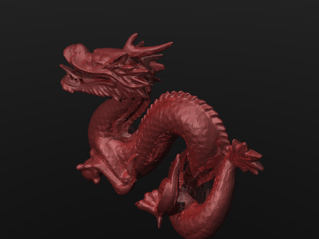

# Raytracer Java

Ce projet est un raytracer écrit en Java permettant de générer des images réalistes à partir de fichiers de scène (format Stanford Dragon inclus).

## Fonctionnalités
- Rendu de triangles et sphères
- Gestion des lumières ponctuelles et directionnelles
- Ombres portées
- Reflets spéculaires (effet miroir)
- Support des fichiers de scène complexes

## Prérequis
- Java 17 ou supérieur
- Maven

## Compilation
Dans le dossier du projet :
```bash
mvn clean package
```

## Utilisation
Pour générer une image à partir d'un fichier de scène :
```bash
java -jar target/raytracer-1.0-SNAPSHOT.jar scenes/final.scene
```
L'image sera générée dans le fichier indiqué dans la scène (ex : `dragon3.png`).

## Exemple de rendu


## Structure du projet
- `src/` : code source Java
- `scenes/` : fichiers de scène
- `target/` : fichiers compilés et images générées

## Auteur
Melvin Dupuis

Projet académique - 2025
